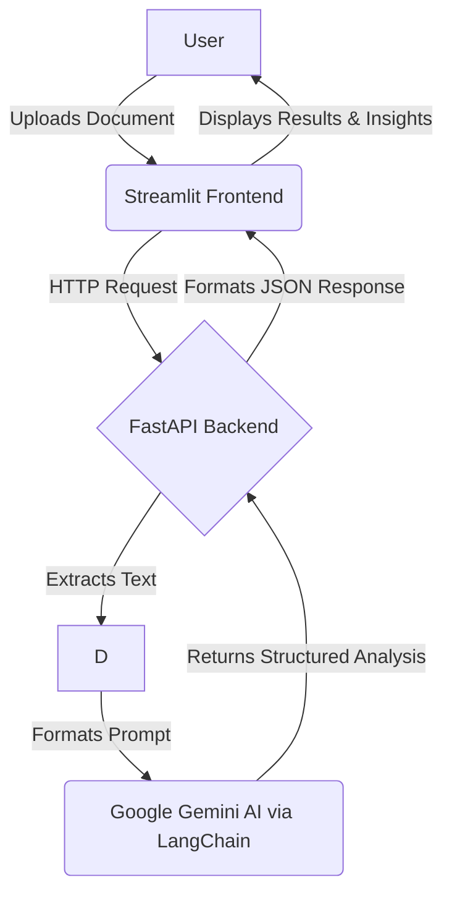

# Intelligent Loan Document Processor

[](https://opensource.org/licenses/MIT)


## Overview

In the financial services industry, the loan origination process is often hampered by time-consuming and error-prone manual document verification. Loan officers must meticulously review a wide variety of documents, such as tax returns, pay stubs, and bank statements, each with a different format and structure. This manual effort slows down approval times, increases operational costs, and introduces the risk of human error.

The Intelligent Loan Document Processor is a sophisticated solution designed to tackle these challenges head-on. By employing the advanced capabilities of Google Gemini AI and the LangChain framework, this application automates the extraction of critical financial data, analyzes documents for inconsistencies, and flags potential issues for review. This automation streamlines the entire verification workflow, enabling faster and more accurate loan processing.

Developed as a submission for a Cognizant Hackathon, this project serves as a powerful proof-of-concept demonstrating the transformative potential of generative AI in the financial sector. Its focused feature set represents a successful prototype, while its architecture provides a solid foundation for future expansion into a production-grade system.

## Live Demonstration

The following demonstrates the application's user-friendly interface and primary workflow: uploading a financial document and receiving a structured analysis powered by AI.


*(Note: A placeholder for a live demonstration GIF or screenshot.)*

## Key Features

The application is equipped with a range of features designed to provide a comprehensive document processing solution.

### Document Intelligence and Processing

- **Multi-Format Ingestion:** Capable of processing a wide array of financial documents, including formats like PDF, DOCX, PNG, JPG, and JPEG.
- **Automated Data Extraction:** Utilizes Google Gemini to intelligently identify and extract critical information, such as applicant name, address, gross income (monthly/annual), and taxes paid from unstructured documents.

### AI-Powered Analysis and Validation

- **Inconsistency Detection:** The AI core analyzes the content of uploaded documents to identify potential discrepancies or red flags that require the attention of a loan officer.
- **Contextual Insights:** Moves beyond simple Optical Character Recognition (OCR) to provide a deeper analysis of the extracted data, highlighting potential risks or issues relevant to the loan application process.

### User Experience and Interface

- **Interactive Frontend:** A clean and modern web interface built with Streamlit offers an intuitive experience for file uploads and visualization of the extracted results.
- **Robust API Backend:** Built on the high-performance FastAPI framework, the system exposes a reliable and scalable API for all document processing tasks.

## System Architecture

The application is built on a modern, decoupled two-tier architecture, a design choice that promotes scalability, maintainability, and a clear separation of concerns. The frontend, built with Streamlit, is responsible for all user interactions, while the backend, powered by FastAPI, handles the computationally intensive tasks of document parsing, AI model interaction, and data processing.

This architectural pattern is particularly effective for AI-driven applications. FastAPI's asynchronous capabilities are ideal for managing I/O-bound operations like making API calls to the Google Gemini service, ensuring the backend remains responsive. Simultaneously, Streamlit enables the rapid development of a rich, interactive user interface directly from Python, making it perfect for data-centric applications like this one. This synergy allows each component to excel at its specific role, resulting in a more robust and efficient system.

### Data Flow Diagram

The diagram below illustrates the flow of data from the user to the AI model and back through the system's components.



## Technology Stack

The project leverages a curated set of modern technologies to deliver its capabilities:

- **Backend:** FastAPI, Uvicorn
- **Frontend:** Streamlit
- **AI & Machine Learning:** Google Gemini, LangChain
- **Document Parsing:** PyPDF, python-docx, Tesseract OCR
- **Data Handling:** Pandas, JSON

## Getting Started

Follow these instructions to set up and run the project on your local machine for development and testing purposes.

### Prerequisites

Ensure you have the following software installed on your system:

- **Git:** For cloning the repository.
- **Python 3.8+:** The core programming language.
- **Tesseract OCR:** Required for extracting text from image-based documents (PNG, JPG, JPEG).
  - **Windows:** [Download the installer](https://github.com/UB-Mannheim/tesseract/wiki).
  - **macOS:** Install via Homebrew: `brew install tesseract`.
  - **Linux (Debian/Ubuntu):** Install via APT: `sudo apt-get install tesseract-ocr`.

### Installation and Configuration

1. **Clone the Repository**

    ```bash
    git clone https://github.com/AtharvaKsh25/Cognizant_Hackathon.git
    cd Cognizant_Hackathon
    ```

2. **Create and Activate a Virtual Environment**

    It is highly recommended to use a virtual environment to manage project dependencies and avoid conflicts with system-wide packages.

    ```bash
    # Create the virtual environment
    python -m venv venv

    # Activate it (command differs by OS)
    # On macOS/Linux:
    source venv/bin/activate
    # On Windows:
    venv\Scripts\activate
    ```

3. **Install Dependencies**

    Install all the required Python packages using the `requirements.txt` file.

    ```bash
    pip install -r requirements.txt
    ```

4. **Configure Environment Variables**

    The application requires a Google Gemini API key to function. Create a file named `.env` in the root directory of the project.

    ```bash
    touch .env
    ```

    Open this new file and add your API key in the following format:

    ```
    GOOGLE_API_KEY="your_gemini_api_key_here"
    ```

### Running the Application

The application consists of two separate components that must be run concurrently in separate terminal windows.

1. **Launch the Backend Server**

    In your first terminal (with the virtual environment activated), start the FastAPI backend server using Uvicorn. The `--reload` flag enables hot-reloading for development.

    ```bash
    uvicorn main:app --reload --host 0.0.0.0 --port 8000
    ```

2. **Launch the Frontend Application**

    Open a **new terminal window**, navigate to the project directory, and activate the virtual environment again. Then, start the Streamlit frontend.

    ```bash
    streamlit run app.py
    ```

### Verification

Once both services are running, open your web browser and navigate to `http://localhost:8501`. You should see the Intelligent Loan Document Processor interface, ready to accept document uploads.

## API Reference

The FastAPI backend exposes a RESTful API endpoint that can be used programmatically, allowing this document processing engine to be integrated into other applications or automated workflows. This design transforms the project from a standalone web application into a reusable microservice.

The primary endpoint is detailed below:

| Method | Endpoint             | Description                                                 | Request Body (Content-Type)         | Success Response (200 OK)                          |
|--------|----------------------|-------------------------------------------------------------|-------------------------------------|----------------------------------------------------|
| POST   | `/process-document/` | Uploads a financial document (PDF, DOCX, image) for extraction and analysis. | `multipart/form-data` with a file part. | A JSON object containing the extracted fields (e.g., `applicant_name`, `gross_income`) and an `ai_analysis` field with insights and red flags. |

## Project Structure

The repository is organized to separate the frontend and backend concerns, promoting a clean and navigable codebase.

```
.
├── .gitignore         # Specifies files for Git to ignore
├── app.py             # Main entrypoint for the Streamlit frontend application
├── main.py            # Main entrypoint for the FastAPI backend API
├── requirements.txt   # A list of all Python dependencies for the project
├── verified_data.csv  # Purpose to be determined; potentially used for testing or data validation
├── README.md          # This documentation file
└── LICENSE            # Contains the full text of the MIT License
```

The presence of `verified_data.csv` without explicit documentation suggests it may be used for internal testing or as a sample dataset for validation purposes. Clarifying its exact role is a potential area for contribution.

## Contributing

Contributions from the community are welcome! If you have suggestions for improving the application, please feel free to fork the repository and submit a pull request.

1. Fork the repository on GitHub.
2. Create a new feature branch (`git checkout -b feature/AmazingFeature`).
3. Make your changes and commit them with a descriptive message (`git commit -m 'Add some AmazingFeature'`).
4. Push your changes to your forked repository (`git push origin feature/AmazingFeature`).
5. Open a Pull Request, clearly describing the changes and referencing any related issues.

For ideas on where to start, please see the [#roadmap-future-enhancements](#roadmap-future-enhancements) section below.

## Roadmap: Future Enhancements

This project has a strong foundation with significant potential for growth. The following is a list of planned enhancements that would further increase its value and capabilities:

- **Batch Document Processing:** Implement functionality to upload and process multiple documents simultaneously.
- **Advanced Document Validation Rules:** Introduce configurable rules to validate extracted data against predefined criteria (e.g., income thresholds).
- **Export to Multiple Formats:** Allow users to export the structured analysis results to formats like CSV or JSON.
- **Integration with Loan Management Systems (LMS):** Develop connectors to push extracted data directly into common LMS platforms.
- **Advanced Fraud Detection:** Enhance the AI model to detect more subtle signs of document tampering or fraudulent information.

## License

This project is licensed under the MIT License. See the [LICENSE](LICENSE) file for full details.

## Acknowledgments

This project was developed by the following contributors as part of a Cognizant Hackathon:

- Atharva Kshirsagar 
- Shailesh Bothe
- Mihir Bhole
- Atharva Talla
- Abhishek Ghadge
- Anuj Nimkar
